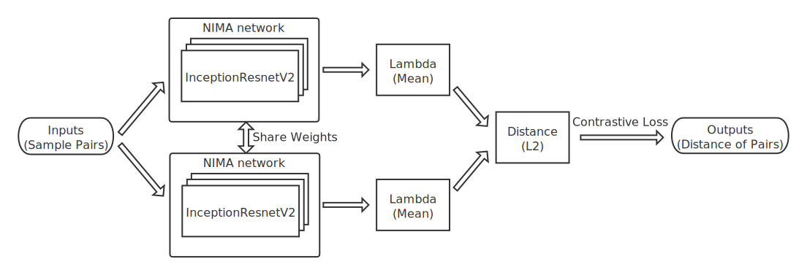

# Image Quality: Siamese NIMA

📖 中文版本：[README](./README_zh.md)

Here, base on the model NIMA<sup>[[1]](#References)</sup> (Neural Image Assessment), proposed by Google, and the Siamese Network<sup>[[2]](#References)</sup>, a **Siamese NIMA** neural network is used to optimize the ablity of model fine-grained ranking.

## Model Networks

The ability of NIMA model to assess image quality comes from the innovation of training mission and the designing of loss function. It uses EMD<sup>[[1]](#References)</sup> (Earth Mover's Distance) loss function to optimize the predicting ability of scoring distribution, rather than simply treat it as a multi-classification mission.

As image scoring distribution is what NIMA learns, the model use AVA<sup>[[3]](#References)</sup> (A Large-Scale Database for Aesthetic Visual Analysis) dataset, which contains a lot of aesthetic images and 1 to 10 user voting results, as its training samples.

Through the design of the training samples and loss function, NIMA can successfully percept the image quality in general. But if we also want it has better ranking ability, we have to make some optimization on NIMA while training. Therefore, here comes Siamese NIMA. It utilize the advantages of siamese networks to futher optimize NIMA networks, so that the model would obtain a certain ability of fine-grained ranking.

Structure of the Siamese NIMA networks is shown bellow.


While training the model, we first use the AVA dataset to bucket the image mean score, then create a list of pairs of samples and labels. After taht, we can reuse the NIMA network and share its weights across the siamese networks, in order to minimize the loss of model ranking distance.

## Pre-trained Weights

**TL;DR**: pre-trained weights have been uploaded on [Releases](https://github.com/ryanfwy/image-quality/releases), please download the corresponding weight file according to different purposes and place it into the directory `./assets/weights/` (optional). 

The weight file of InceptionResnetV2-based NIMA model is provided by [titu1994](https://github.com/titu1994/neural-image-assessment/releases/tag/v0.5)<sup>[[4]](#References)</sup>. Making use of this pre-trained model weight as a part of Siamese NIMA, we can simplify the processes of NIMA model fine-tuning.

Based on the pre-trained weight of NIMA model, we freeze the bottom layers to retain the model's general ability of image expression and unfreeze the rest, in order to optimize the ablity of model fine-grained ranking. In this way, we can obtain a good model even the training dataset is not big enough. By default, the freezing layer is set as `layer_to_freeze=618`.

After training, we can take apart NIMA from Siamese NIMA and save its weight directly, so that when we are trying to predict a batch of images with the model, we can only build a single NIMA model and load its weight.

> If we really want to re-train a new model with Siamese NIMA, we can leave `nima_weight_path` empty while training. However, in this way the model won't optimize the EMD loss function. In other words, the shared part of network is a pure InceptionResnetV2 model instead of NIMA model, which lacks the perception of image quality assessment. In this cases, we'd better first train a new NIMA model and pass the file path of the weight into the training procedure, then continually fine-tune it with Siamese NIMA.

## Results and Comparision

Todo.

## Reference of Running Environment

Model training and predicting are done on AWS EC2 server. Due to the complexity of whether the physical machine has a GPU and the GPU version, the following major environments are listed bellow for reference. For the deployment guidance of the major environments, please refer to [Deployment of Running Environment](#Deployment-of-Running-Environment).

- Physical environment：
    - CPU version ：4 * Intel(R) Xeon(R) CPU E5-2686 @ 2.30GHz
    - CPU memory：64GB
    - GPU version：1 * Nvidia Tesla V100
    - GPU memory：16GB
- Running environment：
    - python：3.6.5
    - keras：2.1.6
    - tensorflow-gpu：1.12.0
    - numpy：1.15.4 (Notice: newest version may not be compatible with tensorflow backend)

## Deployment of Running Environment

### 1. Install Python 3

Different OS have different installation guidance. For details, please refer to https://www.python.org/downloads . For recommendation, the version of Python should not lower than `3.6`.

Check existing version or check whether the installation is succeeded or not, run:

```bash
# Python 3.6.5
python3 -V
```

### 2. Clone Repository

```bash
git clone https://github.com/ryanfwy/image-quality.git
cd image-quality
```

### 3. Create Virtual Environment (Recommended)

Since tensorflow backend has some compatibility issues with its dependencies, it is highly recommended to install dependencies in the virtual environment.

For Anaconda:

```bash
conda create --name image_quality python=3.6
source activate image_quality
```

Or for general environment:

```bash
python3 -m venv .env
source .env/bin/activate
```

### 4-1. Install Dependencies

1）To avoid compatibility issues, Tensorflow 1.12.0 is recommended.

For CPU only:

```bash
pip3 install numpy==1.15.4 Keras==2.2.4 tensorflow==1.12.0
```

For GPU:

```bash
pip3 install numpy==1.15.4 Keras==2.2.4 tensorflow-gpu==1.12.0
```

2）The rest of environments:

```bash
pip3 install -r requirements.txt
```

### 4-2. Install Dependencies (Quicker Way)

If you don't need any customization, you can use [installation.sh](./installation.sh) script as a quicker way to install dependencies.

**Notice**: Ensure that GPU driver is installed successfully before running the script, otherwise the script cannot read the GPU version correctly.

```bash
bash installation.sh
```

## Training and Predicting

### 1. Training Model

If you need to train the model by yourself, you need to prepare the downloaded training images and the data file in advance. The data file should contains at least two columns: `file name` and` label`. Take [Demo](./assets/demo/) for example, the directory tree and the data file should be prepared just like described down bellow.

Image samples directory:

```
./train_images
 |- 267683.jpg
 |- 774992.jpg
 |- ...
 |_ 1246918.jpg
```

Data file `train_data.csv`:

```
file_name label
267683.jpg 1
774992.jpg 2
775717.jpg 0
953019.jpg 4
953619.jpg 6
953958.jpg 3
954113.jpg 8
954184.jpg 7
954228.jpg 5
1246918.jpg 9
...
```

If additional data is used for verification during training, image directory and data file can be prepared as same as described above, and pass it to argument `val_raw` while invoking the `train()` method.

For training script, please see [demo_train.py](./demo_train.py). For more training arguments, please refer to [fit_generator](https://keras.io/models/model/#fit_generator).

```python
from model.siamese_nima import SiameseNIMA

# dirs and paths to load data
train_image_dir = './assets/demo/train_images'
train_data_path = './assets/demo/train_data.csv'

# load data and train model
siamese = SiameseNIMA(output_dir='./assets')
train_raw = siamese.load_data(train_image_dir, train_data_path)
siamese.train(train_raw,
              epochs=5,
              batch_size=16,
              nima_weight_path='./assets/weights/nima_pre_trained.h5')
```

### 2. Predicting with Model

While using the Siamese NIMA model for prediction, in addition to preparing the predicting images, the data file and its loading method must be modified also: the data file must contain at least one column of `file name`.

For predicting script, please see [demo_predict.py](./demo_predict.py). For more predicting arguments, please refer to [predict_generator](https://keras.io/models/model/#predict_generator).

```python
from model.siamese_nima import SiameseNIMA

# dirs and paths to load data
predict_image_dir = './assets/demo/predict_images'
predict_data_path = './assets/demo/predict_data.csv'

# load data and train model
siamese = SiameseNIMA()
predict_raw = siamese.load_data(predict_image_dir, predict_data_path,
                                columns=['file_name'])
results = siamese.predict(predict_raw,
                          nima_weight_path='./assets/weights/nima_pre_trained.h5')
print(results)
```

## References

[1] NIMA: Neural Image Assessment. [[Paper]](https://arxiv.org/abs/1709.05424) [[Repo]](https://github.com/titu1994/neural-image-assessment)  
[2] Siamese Network. [[Demo]](https://github.com/keras-team/keras/blob/master/examples/mnist_siamese.py)  
[3] AVA: A Large-Scale Database for Aesthetic Visual Analysis. [[Refer]](https://www.dpchallenge.com/) [[Repo]](https://github.com/mtobeiyf/ava_downloader)  
[4] neural-image-assessment. [[Repo]](https://github.com/titu1994/neural-image-assessment)

## License

This repository is licensed by [MIT](./LICENSE).
